# HackWords - 企业级 iOS 开发模板

## 🎯 项目概述
HackWords 是一个基于企业级架构的 iOS 开发模板，专门为非专业 iOS 开发者提供快速开发 MVP 应用的完整解决方案。本文档中心提供了完整的技术文档、使用指南和最佳实践。

## 🏗️ 技术架构

### 核心技术栈
- **语言**: Swift 5.7+
- **UI框架**: SwiftUI + UIKit 混合架构
- **数据持久化**: SwiftData (Core Data)
- **依赖管理**: CocoaPods
- **最低支持版本**: iOS 17.0

### 企业级依赖
- **GLWidget**: 自定义 UI 组件库
- **GLUtils**: 工具函数库
- **GLAnalyticsUI**: 分析和追踪框架
- **GLMP**: 模板框架和基础组件
- **GLCore**: 核心功能库
- **GLPurchaseUIExtension**: 购买UI扩展
- **GLAccountExtension**: 账户系统扩展
- **GLResource**: 资源管理库

### 架构模式
- **MVVM**: 主要的架构模式
- **Composable UI**: 基于 ComposableUIComponent 协议的组件化架构
- **Navigator Pattern**: 统一的页面导航管理
- **Repository Pattern**: 数据访问层抽象

## 📁 项目结构

### 项目结构图

```mermaid
graph TB
    A[HackWeek 项目] --> B[主应用 HackWeek/]
    A --> C[本地依赖 PodsLocal/]
    A --> D[外部依赖 Pods/]
    A --> E[文档中心 Documentation/]
    A --> F[迭代历史 SPRINT_ARCHIVE/]

    B --> G[核心框架 Core/]
    B --> H[功能模块 Features/]
    B --> I[基础设施 Incubator/]
    B --> J[静态资源 Resources/]

    G --> G1[导航系统 ViewStack/]
    G --> G2[组件框架 ComposableUI/]
    G --> G3[埋点系统 Tracking/]

    H --> H1[用户引导 Onboarding/]
    H --> H2[单词学习 WordBook/]
    H --> H3[付费转化 VipConversion/]
    H --> H4[模板演示 TemplateDemo/]

    I --> I1[导航核心 ViewStack/]
    I --> I2[转化功能 ConversionMisc/]
    I --> I3[UI组件库 UI/]

    C --> C1[配置管理 AppConfig/]

    E --> E1[使用指南 Guides/]
    E --> E2[模块文档 Modules/]
    E --> E3[API参考 API/]

    E1 --> E1a[核心能力映射]
    E1 --> E1b[导航系统指南]
    E1 --> E1c[拍照功能指南]
    E1 --> E1d[LLM调用指南]
    E1 --> E1e[数据持久化指南]
    E1 --> E1f[提示词工程指南]
    E1 --> E1g[代码生成模板]
    E1 --> E1h[故障排除指南]

    E2 --> E2a[基础设施模块]
    E2 --> E2b[用户引导模块]
    E2 --> E2c[单词学习模块]
    E2 --> E2d[付费转化模块]
```


### 目录详细结构
```
HackWeek/
├── HackWeek/                     # 主应用
│   ├── Core/                     # 核心框架层
│   │   ├── ViewStack/           # 导航系统 ✅ 已完成
│   │   ├── ComposableUI/        # 组件框架 ✅ 已完成
│   │   └── Tracking/            # 埋点系统 ✅ 已完成
│   ├── Features/                # 功能模块
│   │   ├── Onboarding/          # 用户引导 ✅ 已完成
│   │   │   ├── OnboardingManager.swift
│   │   │   ├── OnboardingRootView.swift
│   │   │   ├── OnboardingWelcomePage.swift
│   │   │   ├── OnboardingAgePage.swift
│   │   │   └── OnboardingChooseLanguagePage.swift
│   │   ├── WordBook/            # 单词学习 ✅ 已完成
│   │   │   ├── MainAppView.swift
│   │   │   ├── CameraPage.swift
│   │   │   ├── WordBookPage.swift
│   │   │   ├── IdentificationPage.swift
│   │   │   ├── Data/              # 数据模型
│   │   │   │   ├── WordBook.swift
│   │   │   │   ├── WordModel.swift
│   │   │   │   └── WordBookDataContainer.swift
│   │   │   └── Managers/         # 管理器
│   │   │       └── WordBookManager.swift
│   │   └── VipConversion/       # 付费转化 ✅ 已完成
│   │       ├── TrialableVipConversionPage.swift
│   │       ├── HistoryVipConversionView.swift
│   │       └── VipConversionViewModel.swift
│   ├── Incubator/               # 基础设施
│   │   ├── ViewStack/           # 导航系统核心
│   │   │   ├── Navigator.swift
│   │   │   ├── ComposableUI.swift
│   │   │   └── ComposableEnv.swift
│   │   ├── ConversionMisc/      # 转化相关功能
│   │   └── UI/                  # UI 组件库
│   └── Resources/               # 静态资源
├── PodsLocal/                   # 本地依赖
│   └── AppConfig/               # 配置管理 ✅ 已完成
├── Pods/                        # 外部依赖
├── Documentation/               # 📚 文档中心
│   ├── README.md               # 文档中心入口
│   ├── Guides/                 # 使用指南
│   │   ├── CoreCapabilities.md
│   │   ├── Navigator_Usage_Guide.md
│   │   ├── Camera_Usage_Guide.md
│   │   ├── LLM_Usage_Guide.md
│   │   ├── DataPersistence_Usage_Guide.md
│   │   ├── Prompt_Engineering_Guide.md
│   │   ├── Code_Generation_Templates.md
│   │   └── Troubleshooting_Guide.md
│   └── Modules/                # 模块详细文档
│       ├── Incubator/README.md
│       ├── Onboarding/README.md
│       ├── WordBook/README.md
│       └── VipConversion/README.md
├── .spec-workflow/              # 工作流模板
└── SPRINT_ARCHIVE/              # 迭代历史
```

## ✨ 四大核心能力

### 1. 🗺️ 路由系统 (Navigator Pattern)
**功能**: 企业级的统一导航管理
- ✅ Push 导航: 标准页面栈跳转
- ✅ Present 导航: 模态页面展示
- ✅ Popup 导航: 底部弹窗功能
- ✅ Replace 导航: 页面替换功能
- ✅ 自动埋点追踪
- ✅ 类型安全保证

**核心组件**: `Incubator/ViewStack/Navigator.swift`
**详细指南**: [Navigator 使用指南](Documentation/Guides/Navigator_Usage_Guide.md)

### 2. 📸 拍照功能 (Camera Integration)
**功能**: 完整的相机和图片处理系统
- ✅ 相机权限管理
- ✅ 拍照和图片选择
- ✅ 图片预览功能
- ✅ 基础图片处理
- ✅ 错误处理机制

**核心组件**: `Features/WordBook/CameraPage.swift`
**详细指南**: [拍照功能指南](Documentation/Guides/Camera_Usage_Guide.md)

### 3. 🤖 LLM 调用服务 (AI Integration)
**功能**: 标准化的 AI 服务集成
- ✅ 文本分析接口
- ✅ 图片识别功能
- ✅ 对话和聊天系统
- ✅ 错误重试机制
- ✅ 多 AI 提供商支持

**接口位置**: `TemplateAPI.ChatGPT`
**详细指南**: [LLM 使用指南](Documentation/Guides/LLM_Usage_Guide.md)

### 4. 💾 数据结构管理 (Data Persistence)
**功能**: 基于 SwiftData 的数据持久化
- ✅ SwiftData 数据模型
- ✅ CRUD 操作接口
- ✅ 数据查询构建
- ✅ 数据关系管理
- ✅ 迁移支持

**核心组件**: `Features/WordBook/Data/`
**详细指南**: [数据持久化指南](Documentation/Guides/DataPersistence_Usage_Guide.md)

## 🚀 快速开始

### 环境要求
- Xcode 15.0+
- iOS 17.0+
- CocoaPods 1.11+

### 安装和运行
```bash
# 1. 安装依赖
pod install

# 2. 打开项目
open HackWeek.xcworkspace

# 3. 选择目标和模拟器
# 目标: HackWeek
# 模拟器: iPhone 17

# 4. 构建运行(只关注 error)
xcodebuild -workspace HackWeek.xcworkspace -scheme HackWeek -destination 'platform=iOS Simulator,name=iPhone 17' build -quiet
```

### 基础使用示例

#### 创建新页面
```swift
struct MyPage: ComposablePageComponent {
    struct Props {
        let title: String
        let onAction: () -> Void
    }

    let props: Props
    var pageName: String { "my_page" }
    var pageTrackingParams: [String: Any]? {
        [.TRACK_KEY_TYPE: "demo"]
    }

    var body: some View {
        VStack {
            Text(props.title)
            Button("Action") {
                props.onAction()
                tracking("my_page_button_click", [.TRACK_KEY_TYPE: "primary"])
            }
        }
    }
}

// 导航到新页面
TemplateAPI.Navigator.push(MyPage(props: MyPageProps(
    title: "Hello World",
    onAction: { print("Action tapped") }
)), from: "home", animated: true)
```

#### 使用拍照功能
```swift
struct CameraDemo: ComposablePageComponent {
    @StateObject private var viewModel = CameraDemoViewModel()

    var body: some View {
        VStack {
            if let image = viewModel.capturedImage {
                Image(uiImage: image)
                    .resizable()
                    .aspectRatio(contentMode: .fit)
            }

            Button("拍照") {
                viewModel.showCamera()
            }
        }
        .connect(viewModel: viewModel)
    }
}
```

## 📚 文档中心

### 📖 使用指南
- **[核心能力指南](Documentation/Guides/CoreCapabilities.md)** - 四大核心能力详解
- **[路由系统指南](Documentation/Guides/Navigator_Usage_Guide.md)** - Navigator 使用方法
- **[LLM 调用指南](Documentation/Guides/LLM_Usage_Guide.md)** - AI 服务集成指南
- **[拍照功能指南](Documentation/Guides/Camera_Usage_Guide.md)** - 相机和图片处理指南
- **[数据持久化指南](Documentation/Guides/DataPersistence_Usage_Guide.md)** - SwiftData 使用方法
- **[提示词工程指南](Documentation/Guides/Prompt_Engineering_Guide.md)** - AI 编程协作技巧
- **[代码生成模板](Documentation/Guides/Code_Generation_Templates.md)** - 常用代码模板
- **[故障排除指南](Documentation/Guides/Troubleshooting_Guide.md)** - 常见问题解决方案

### 📦 模块文档
- **[Incubator 模块](Documentation/Modules/Incubator/README.md)** - 基础设施组件
- **[Onboarding 模块](Documentation/Modules/Onboarding/README.md)** - 用户引导流程
- **[WordBook 模块](Documentation/Modules/WordBook/README.md)** - 单词学习系统
- **[VipConversion 模块](Documentation/Modules/VipConversion/README.md)** - 付费转化系统

### 🎯 快速开始
- 对于**产品经理/设计师**: 查看文档中心的使用指南
- 对于**其他端开发者**: 从核心能力指南开始学习
- 对于**iOS 初学者**: 参考模块文档中的代码示例

## 🔧 配置系统

### 主要配置文件

1. **TemplateConfig** - `HackWeek/TemplateAPI.swift`
   ```swift
   struct TemplateConfig {
       static var rootView: AnyView { /* 根视图配置 */ }
       static var conversionView: AnyView { /* 转化页配置 */ }
       static var showConversionAtLaunch: Bool { /* 启动时转化页逻辑 */ }
   }
   ```

2. **AppConfigMisc** - `PodsLocal/AppConfig/AppConfig/AppConfigMisc.swift`
   ```swift
   struct AppEvoConfig {
       static var skuConfig: [AppSkuConfigModel] { /* SKU 配置 */ }
   }
   ```

### 配置修改指南
对于开发者，可以通过以下方式修改配置：
1. **修改根视图**: 在 TemplateConfig.swift 中修改 `rootView`
2. **配置 SKU**: 在 AppConfigMisc.swift 中修改 `skuConfig` 数组
3. **自定义页面**: 创建新的 SwiftUI 页面并配置到相应位置

## 🛠️ 开发指南

### ComposableUI 组件开发
1. **继承协议**: 使用 `ComposableUIComponent` 或 `ComposablePageComponent`
2. **Props 设计**: 定义组件的输入参数结构体
3. **状态管理**: 使用 `@StateObject` 和 `@ObservedObject`
4. **埋点追踪**: 使用 3 段式命名规范

### 导航最佳实践
1. **统一入口**: 所有导航都通过 `TemplateAPI.Navigator` 静态方法
2. **类型安全**: 使用 `ComposablePageComponent` 确保类型安全
3. **参数传递**: 通过 Props 结构体传递参数
4. **追踪集成**: 自动追踪页面访问和用户行为

### 数据持久化
1. **SwiftData 模型**: 使用 `@Model` 宏定义数据模型
2. **Repository 模式**: 通过 Repository 访问数据
3. **异步操作**: 使用 Swift Concurrency 处理数据操作
4. **错误处理**: 统一的错误处理机制

## 🎯 目标用户指南

### 产品经理
- 了解技术实现可能性
- 快速验证产品概念
- 参与功能设计和测试

### 设计师
- 学习 iOS 设计规范
- 了解组件化设计方法
- 参与UI/UX优化

### 其他端开发者
- 跨平台开发 iOS 应用
- 学习企业级架构模式
- 快速上手 iOS 开发

### iOS 初学者
- 学习最佳实践
- 了解企业级项目结构
- 获得完整的代码示例

## 🔄 模板化进度

### ✅ 已完成
- **导航系统**: 完整的 Navigator Pattern 实现
- **组件框架**: ComposableUI 组件系统
- **用户引导**: Onboarding 流程模板
- **单词学习**: WordBook 功能模块
- **付费转化**: VipConversion 系统
- **配置系统**: 多环境配置支持
- **文档系统**: 完整的技术文档中心

### 🚧 开发中
- **LLM 调用**: AI 服务集成模块 (基于现有 TemplateAPI)
- **模板演示**: 四大核心能力展示页面

### 📋 待开发
- **高级组件**: 更多可复用组件
- **测试模板**: 单元测试和 UI 测试模板
- **部署指南**: 应用打包和发布流程

## 🤝 贡献指南

### 代码贡献
1. 遵循现有代码风格和架构模式
2. 添加必要的注释和文档
3. 确保所有功能都有测试覆盖
4. 提交前运行完整测试

### 文档贡献
1. 使用清晰易懂的语言
2. 提供完整的代码示例
3. 包含常见问题和解决方案
4. 考虑不同技术背景的读者

## 📄 许可证

本项目采用 MIT 许可证，详见 [LICENSE](LICENSE) 文件。

## 📞 技术支持

如有问题或建议，请：
1. 查看文档和 [故障排除指南](Documentation/Guides/Troubleshooting_Guide.md)
2. 搜索相关的模块文档
3. 参考使用指南中的示例
4. 创建新的 Issue 描述问题

## 🗂️ 导航面包屑

> **当前位置**: [项目根目录](CLAUDE.md) > HackWords 模板项目

### 相关模块文档链接
- **[文档中心](Documentation/README.md)** - 完整的文档导航
- **[核心能力指南](Documentation/Guides/CoreCapabilities.md)** - 四大核心能力详解
- **[Incubator 模块](Documentation/Modules/Incubator/README.md)** - 基础设施组件详情
- **[Onboarding 模块](Documentation/Modules/Onboarding/README.md)** - 用户引导流程详情
- **[WordBook 模块](Documentation/Modules/WordBook/README.md)** - 单词学习系统详情
- **[VipConversion 模块](Documentation/Modules/VipConversion/README.md)** - 付费转化系统详情

---

## 变更记录

### 2025-10-16
- ✅ **架构完善**: 根据文档中心更新项目结构图和详细目录结构
- ✅ **Mermaid 图表**: 添加项目结构可视化图表
- ✅ **导航优化**: 完善模块间的导航链接和面包屑导航
- ✅ **状态更新**: 更新所有模块的完成状态（✅ 已完成 / 🚧 开发中）

### 历史迭代
- ✅ Onboarding 用户引导功能
- ✅ 单词本存储和管理功能
- ✅ 拍照识别功能实现
- ✅ 付费转化页功能
- ✅ 简化版学习计划
- ✅ 主界面UI实现
- ✅ 编译错误修复和 API 统一
- ✅ 完整技术文档系统

---

**重要提醒**:
- 本项目基于企业级架构，依赖众多专业库
- 适合作为学习企业级开发的参考模板
- 所有功能都经过实际项目验证
- 可直接用于生产环境或作为新项目基础