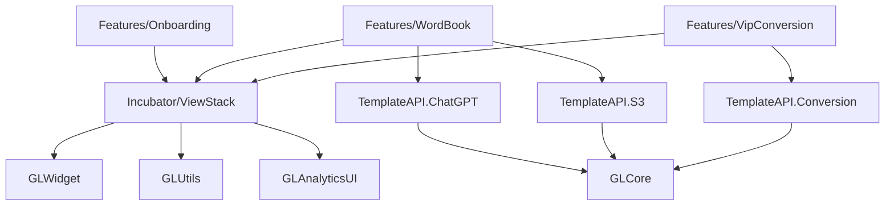

# HackWeek 四大核心能力映射文档

## 概述

本文档详细说明了 HackWeek 模板中四大核心能力在现有代码结构中的具体体现位置，为开发者提供清晰的技术架构视图。

## 四大核心能力详细映射

### 1. 🗺️ 路由系统 (Navigator Pattern)

#### 核心实现位置
- **主要API**: `HackWeek/TemplateAPI.swift` 中的 `NavigatorAPI` 协议
- **实现类**: `HackWeek/Incubator/ViewStack/Navigator.swift`
- **组件系统**: `HackWeek/Incubator/ViewStack/ComposableUI.swift`
- **环境变量**: `HackWeek/Incubator/ViewStack/ComposableEnv.swift`

#### 关键文件清单
```
HackWeek/
├── TemplateAPI.swift              # NavigatorAPI 协议定义
├── Incubator/ViewStack/
│   ├── Navigator.swift            # 导航管理器核心实现
│   ├── ComposableUI.swift         # 可组合UI组件协议
│   ├── ComposableEnv.swift        # 环境变量系统
│   └── NavigatorExtensions.swift  # 导航扩展方法
```

#### 功能特性
- ✅ Push 导航: `Navigator.push()`
- ✅ Present 导航: `Navigator.present()`
- ✅ Popup 导航: `Navigator.showPopup()`
- ✅ Replace 导航: `Navigator.pushReplace()`
- ✅ 自动埋点追踪集成
- ✅ 类型安全保证

#### 使用示例位置
- **Onboarding 流程**: `HackWeek/Features/Onboarding/OnboardingRootView.swift`
- **页面跳转**: 各 Feature 模块中的导航调用

### 2. 📸 拍照功能 (Camera Integration)

#### 核心实现位置
- **主界面**: `HackWeek/Features/WordBook/CameraPage.swift`
- **业务逻辑**: `HackWeek/Features/WordBook/CameraViewModel.swift`
- **图片处理**: `HackWeek/Features/WordBook/IdentificationViewModel.swift`

#### 关键文件清单
```
HackWeek/Features/WordBook/
├── CameraPage.swift              # 相机界面实现
├── CameraViewModel.swift         # 相机业务逻辑
├── IdentificationPage.swift      # 图片识别页面
└── IdentificationViewModel.swift  # 图片处理和识别逻辑
```

#### 功能特性
- ✅ 相机权限管理
- ✅ 实时预览功能
- ✅ 拍照和图片选择
- ✅ 图片预览和处理
- ✅ VisionKit 抠图功能 (iOS 17+)
- ✅ 错误处理机制

#### 依赖集成
- **GLCamera**: 通过 TemplateAPI 集成企业级相机功能
- **Vision/VisionKit**: 系统级图片处理
- **TemplateAPI.S3**: 图片上传存储

### 3. 🤖 LLM 调用服务 (AI Integration)

#### 核心实现位置
- **API 协议**: `HackWeek/TemplateAPI.swift` 中的 `ChatGPTAPI` 协议
- **数据模型**: `HackWeek/GPTAPI.swift`
- **使用示例**: `HackWeek/Features/WordBook/IdentificationViewModel.swift`

#### 关键文件清单
```
HackWeek/
├── TemplateAPI.swift              # ChatGPTAPI 协议定义
├── GPTAPI.swift                   # LLM 数据模型和类型定义
├── Features/WordBook/
│   └── IdentificationViewModel.swift # LLM 调用示例
└── Documentation/
    └── LLM_Usage_Guide.md         # LLM 使用指南文档
```

#### 功能特性
- ✅ 会话管理: `createSession()`, `fetchMessages()`
- ✅ 消息发送: `sendMessage()`, `llmCompletion()`
- ✅ 图片识别支持: 通过 imageUrl 参数
- ✅ 配置化模型选择: GPTConfig
- ✅ 错误处理和重试机制

#### 实际应用场景
- **图片识别**: WordBook 中的单词识别功能
- **文本处理**: 系统指令和用户消息处理
- **数据生成**: 批量数据处理能力

### 4. 💾 数据结构管理 (Data Persistence)

#### 核心实现位置
- **数据模型**: `HackWeek/Features/WordBook/Models/`
- **数据管理**: `HackWeek/Features/WordBook/Managers/`
- **数据容器**: `HackWeek/Features/WordBook/Data/`

#### 关键文件清单
```
HackWeek/Features/WordBook/
├── Models/
│   ├── WordBook.swift             # 单词本数据模型
│   └── WordModel.swift            # 单词数据模型
├── Managers/
│   └── WordBookManager.swift      # 数据管理器
├── Data/
│   └── WordBookDataContainer.swift # SwiftData 容器配置
└── Views/
    └── WordBookExampleView.swift  # 数据展示示例
```

#### 功能特性
- ✅ SwiftData 数据持久化
- ✅ CRUD 操作接口
- ✅ 数据关系管理
- ✅ 查询构建支持
- ✅ 数据迁移支持
- ✅ 学习算法集成 (遗忘曲线)

#### 数据模型结构
- **WordBook**: 按天组织的单词本容器
- **WordModel**: 单个单词的完整信息
- **学习算法**: 简化版遗忘曲线实现

## 企业级依赖集成

### GL 系列库依赖
```
PodsLocal/GLWidget/          # 自定义 UI 组件库
PodsLocal/GLUtils/           # 工具函数库
PodsLocal/GLAnalyticsUI/     # 分析和追踪框架
PodsLocal/GLMP/              # 模板框架
PodsLocal/GLCore/            # 核心功能库
```

### 配置系统
```
HackWeek/TemplateAPI.swift   # TemplateConfig 配置
PodsLocal/AppConfig/         # AppConfigMisc SKU 配置
```

## 模块间依赖关系



## 技术架构总结

### 设计模式
- **MVVM**: 主要的架构模式
- **Repository Pattern**: 数据访问层抽象
- **Navigator Pattern**: 统一导航管理
- **Composable UI**: 基于协议的组件化架构

### 技术栈
- **Swift 5.7+**: 主要开发语言
- **SwiftUI + UIKit**: 混合 UI 框架
- **SwiftData**: 数据持久化
- **CocoaPods**: 依赖管理
- **iOS 15.0+**: 最低支持版本

### 核心优势
1. **企业级架构**: 基于 GL 系列库的稳定架构
2. **类型安全**: 完整的 Swift 类型系统支持
3. **模块化设计**: 清晰的模块边界和职责分离
4. **可扩展性**: 基于协议的可扩展架构
5. **完整功能**: 四大核心能力的完整实现

## 使用指南索引

- [LLM 调用服务](./LLM_Usage_Guide.md) - 详细的使用指南
- [路由系统使用指南](./Navigator_Usage_Guide.md) - 完整使用指南
- [拍照功能使用指南](./Camera_Usage_Guide.md) - 待完善
- [数据持久化使用指南](./DataPersistence_Usage_Guide.md) - 待完善

## 模块文档索引

- [Incubator 模块](../Modules/Incubator/README.md) - 基础设施模块
- [Onboarding 模块](../Modules/Onboarding/README.md) - 用户引导模块
- [WordBook 模块](../Modules/WordBook/README.md) - 单词学习模块
- [VipConversion 模块](../Modules/VipConversion/README.md) - 付费转化模块

---

*此文档随项目更新而维护，最后更新时间: 2025-10-16*